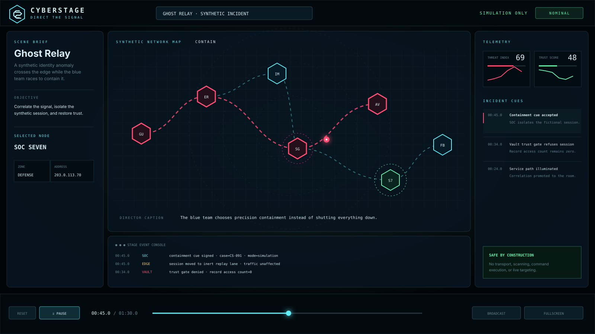

<p align="center">
  
</p>

<h1 align="center">CyberStage</h1>

<p align="center"><strong>Do not attack. Direct the scene.</strong></p>

<p align="center">
  A cinematic, simulation-only cyber operations stage for film, education, demos, streams, and visual storytelling.
</p>

<p align="center">
  <a href="https://github.com/zszbyzsz/CyberStage/actions/workflows/ci.yml"></a>
  <a href="./LICENSE"></a>
  
  
</p>

<p align="center">
  <a href="https://zszbyzsz.github.io/CyberStage/"><strong>Open the live stage</strong></a>
  ·
  <a href="./README.zh-CN.md">简体中文</a>
  ·
  <a href="./docs/scenario-format.md">Create a scene</a>
  ·
  <a href="./docs/scene-catalogue.md">Scene catalogue</a>
</p>



> [!IMPORTANT]
> CyberStage is a **visual simulator**, not a penetration-testing framework or cyber range. It does not scan networks, transmit packets, execute shell commands, or target live systems. All built-in identifiers use documentation-only address ranges.

## What makes it fun

CyberStage turns defensive telemetry into something that can be **directed like a scene**:

- Play, pause, scrub, loop, and change speed on a deterministic incident timeline.
- Watch signals travel across an animated SVG topology while nodes change state.
- Cut between [nine built-in story worlds](./docs/scene-catalogue.md), including password auditing, server-control contention, ransomware recovery, phishing response, availability defense, and software-integrity incidents.
- Enter **Broadcast Mode** for a clean full-screen shot suitable for video or projection.
- Enable a small local soundscape generated with the Web Audio API—no audio files required.
- Click any node to inspect its fictional zone, address, links, and signal state.
- Import a local JSON scene without uploading it anywhere.
- Share a scene, timestamp, playback state, and broadcast framing in one URL.

The entire runtime is browser-native JavaScript, CSS, and SVG. There is no package installation step and no runtime dependency graph.

## Run it locally

CyberStage requires Node.js 22 or newer only for the tiny local server and tests.

```bash
git clone https://github.com/zszbyzsz/CyberStage.git
cd CyberStage
npm start
```

Open the local address printed by the server. No `npm install` is required.

Useful commands:

```bash
npm test       # deterministic engine and safety tests
npm run guard  # syntax, CSP, scenario, and capability checks
npm run build  # produce a static dist/ directory
npm run check  # run every project check
```

## Director controls

| Input | Action |
| --- | --- |
| `Space` | Play or pause |
| `←` / `→` | Seek backward or forward five seconds |
| `R` | Reset the current scene |
| `B` | Toggle Broadcast Mode |
| `F` | Toggle fullscreen |
| `1`–`9` | Select a scene |

The timeline, event feed, playback-speed buttons, and topology nodes are also interactive.

## Scene model

A CyberStage scene is event-sourced JSON:

```json
{
  "id": "signal-rehearsal",
  "title": "Signal Rehearsal",
  "safety": "simulation-only",
  "theme": "cyan",
  "durationMs": 20000,
  "nodes": [],
  "links": [],
  "events": []
}
```

Each event can update metrics, node states, link states, captions, console lines, and one animated signal flow. Start with [`examples/minimal-scene.json`](./examples/minimal-scene.json), read the [scenario-format guide](./docs/scenario-format.md), and validate against [`schema/scenario.schema.json`](./schema/scenario.schema.json).

## Architecture

```text
Scene JSON
   │
   ▼
Safety validator ── rejects live addresses, URLs, invalid graph references
   │
   ▼
Scenario compiler ── sorts and freezes a deterministic event timeline
   │
   ▼
Frame derivation ── pure reduction from (scene, time) to visual state
   │
   ├── SVG topology
   ├── telemetry cards
   ├── incident cue feed
   ├── generated event console
   └── director timeline / URL state
```

The engine does not mutate a scene while it plays. Every frame is derived from the same scene and timestamp, making playback reproducible and testable. See [architecture](./docs/architecture.md).

## Safety by construction

CyberStage uses several independent boundaries:

1. The runtime Content Security Policy sets `connect-src 'none'`.
2. CI rejects common browser network-transport primitives inside `src/`.
3. Imported scenes are validated before rendering.
4. IPv4 values must use `192.0.2.0/24`, `198.51.100.0/24`, or `203.0.113.0/24`.
5. Rendered custom text is escaped before entering HTML or SVG.
6. No `eval`, shell bridge, native addon, server component, or remote asset is required.

Read the complete [safety model](./docs/safety-model.md). Security problems that weaken these invariants are treated as vulnerabilities; see [`SECURITY.md`](./SECURITY.md).

## Project status

**v0.1.0** is a complete interactive proof of concept. The next major step is a visual scene composer with drag-and-drop nodes, an event-track editor, local export, undo/redo, and reusable scene packs. The longer roadmap is intentionally focused on cinematic authoring rather than offensive capability.

See the [roadmap](./docs/roadmap.md) and [changelog](./CHANGELOG.md).

## Contributing

Contributions are welcome from frontend developers, motion designers, writers, educators, accessibility reviewers, and security engineers. A contribution does not need to contain code: a strong fictional scene, sound design idea, accessibility audit, or clearer documentation can be equally valuable.

Please read [`CONTRIBUTING.md`](./CONTRIBUTING.md) and preserve the simulation-only invariants described in [`AGENTS.md`](./AGENTS.md).

## License

CyberStage is available under the [MIT License](./LICENSE).

The name, interface, fictional organizations, addresses, logs, and scenarios do not represent real systems or incidents.
